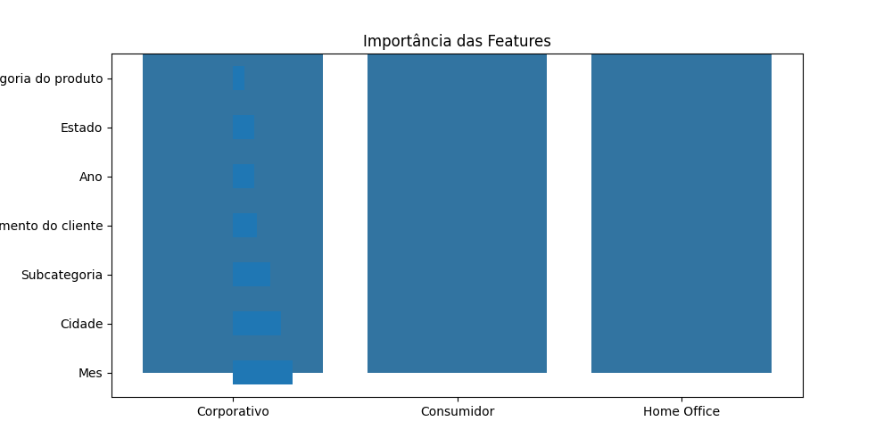
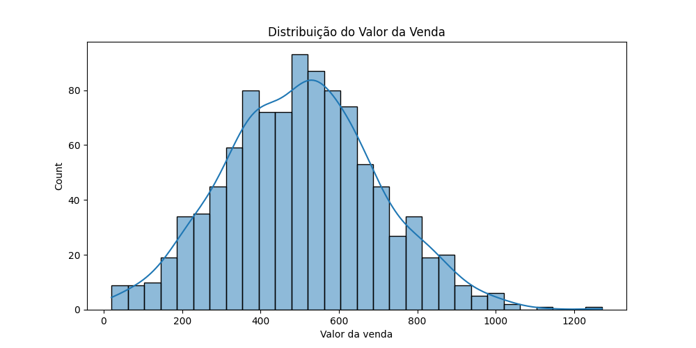
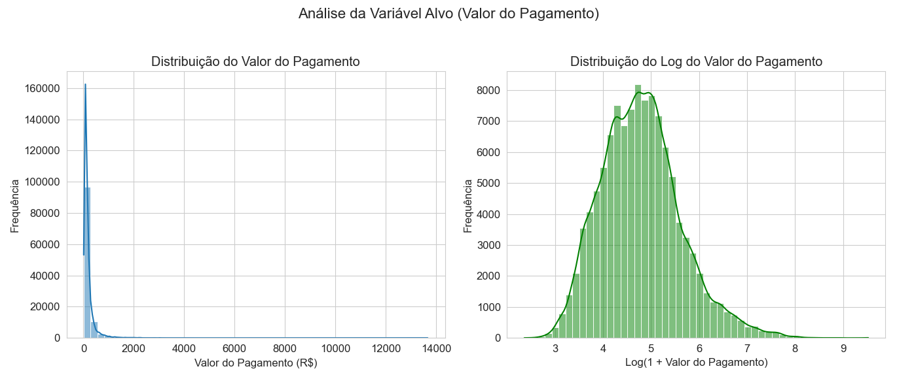
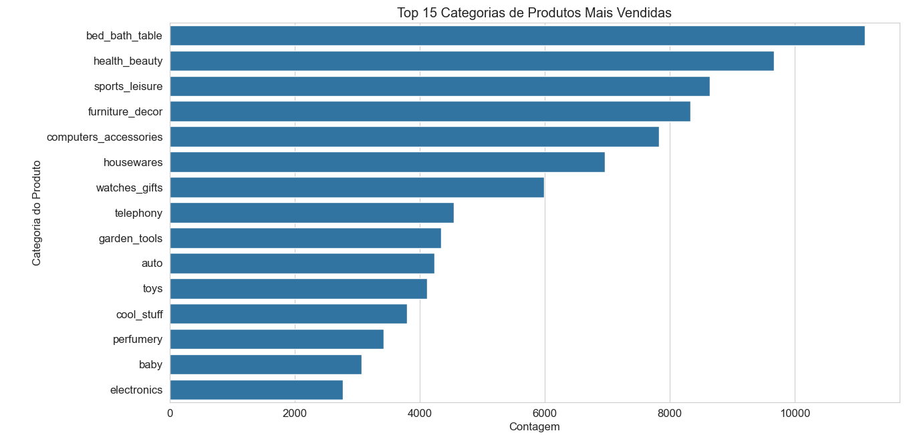
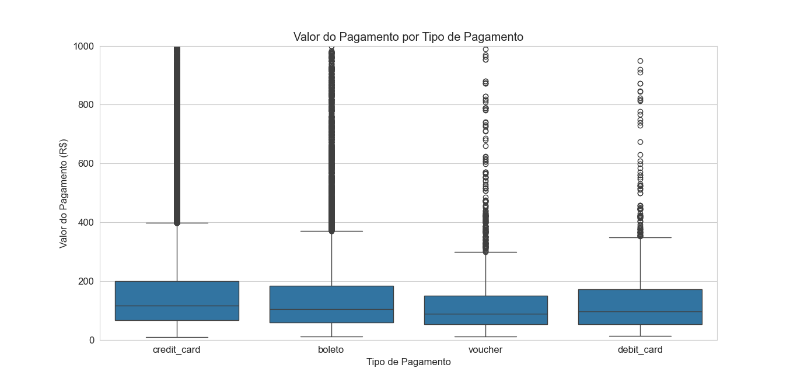
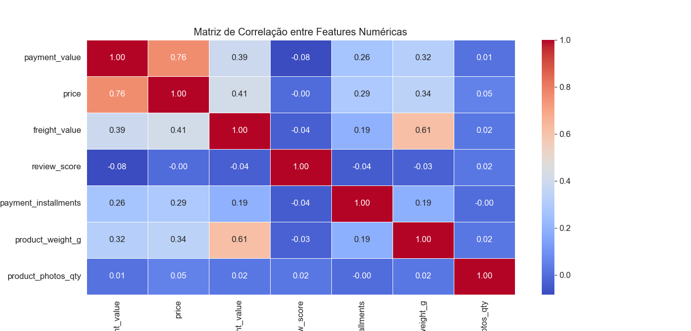
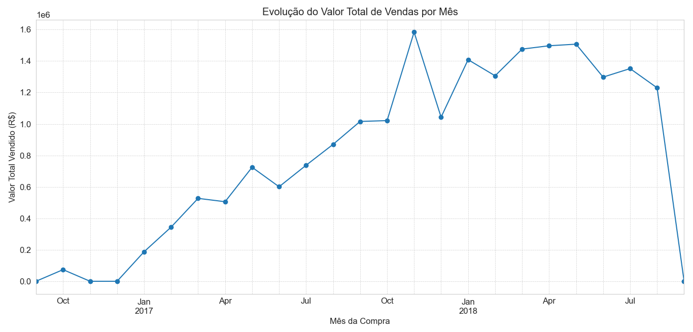

# Projeto de Machine Learning: Previsão de Valor de Venda

Este projeto utiliza um conjunto de dados públicos da Olist (e-commerce brasileiro) para construir um pipeline completo de Machine Learning, para prever o valor total de uma venda. O projeto abrange desde a combinação e limpeza dos dados até o treinamento de um modelo preditivo e sua disponibilização em um dashboard interativo.

## 📁 Estrutura de Pastas

Para que os scripts funcionem corretamente, seu projeto deve seguir a seguinte estrutura de pastas e arquivos:

```
seu-projeto/
│
│── data/
│   └── (Esta pasta será criada pelo script 'main.py')
│
├── data_processed/
│   └── (Esta pasta será criada pelo script 'preparar_dados.py')
│
├── database/
│   ├── olist_customers_dataset.csv
│   ├── olist_geolocation_dataset.csv
│   ├── ... (todos os 9 arquivos .csv da Olist)
│   └── product_category_name_translation.csv
│
├── img/
│   └── (Esta pasta será criada pelo script 'main.py')
│
├── outros/
│   └── (Esta pasta será criada pelo script 'dashboard.py')
│
├── preparar_dados.py
├── engenharia_features.py
├── main.py
└── dashboard.py
```

## DataBase

Primeiro você precisa criar uma pasta com o nome de database e depois baixar e salvar nessa pasta os arquivos csv do [Brazilian E-Commerce Public Dataset by Olist](https://www.kaggle.com/datasets/olistbr/brazilian-ecommerce) que ao todo são 9 arquivos.


## 🛠️ Pré-requisitos e Instalação

Antes de rodar os scripts, é necessário instalar todas as bibliotecas Python utilizadas.

1.  Crie um arquivo chamado `requirements.txt` na pasta principal do seu projeto.
2.  Copie e cole o seguinte conteúdo dentro do arquivo `requirements.txt`:
    ```
    pandas
    numpy
    scikit-learn
    joblib
    streamlit
    fpdf
    matplotlib
    seaborn
    ```
3.  Abra o terminal na pasta do seu projeto e execute o seguinte comando para instalar todas as dependências de uma só vez:
    ```bash
    pip install -r requirements.txt
    ```

## 🚀 Como Rodar o Projeto (Ordem de Execução)

É **essencial** executar os scripts na ordem correta, pois cada um depende dos arquivos gerados pelo anterior.

### Passo 1: Preparar e Combinar os Dados
Este script pega os 9 arquivos `.csv` da pasta `data/`, combina todos eles em um único dataset e o salva.

```bash
python preparar_dados.py
```
* **Entrada:** Os 9 arquivos `.csv` na pasta `data/`.
* **Saída:** Cria a pasta `data_processed/` e, dentro dela, o arquivo `olist_dataset_completo.csv`.

### Passo 2: Limpeza e Engenharia de Features
Este script carrega o dataset combinado, realiza a limpeza, remove colunas desnecessárias e cria novas features preditivas (como tempo de entrega, dia da semana, etc.).

```bash
python engenharia_features.py
```
* **Entrada:** `data_processed/olist_dataset_completo.csv`.
* **Saída:** O arquivo `dataset_para_modelo.csv` na pasta `database/`, pronto para o treinamento.

### Passo 3: Treinar o Modelo de Machine Learning
Este script carrega o dataset final processado, treina o modelo `RandomForestRegressor` usando um pipeline robusto e `GridSearchCV` para otimização, e salva o modelo treinado e suas métricas.

```bash
python main.py
```
* **Entrada:** `database/dataset_para_modelo.csv`.
* **Saída:** Cria a pasta `data/` e, dentro dela, os arquivos:
    * `modelo_vendas.pkl` (o pipeline completo do modelo).
    * `model_metrics.json` (as métricas de desempenho, como R² e MSE).
    * `encoders.pkl` (os nomes das features processadas).






### Passo 4: Executar o Dashboard Interativo
Finalmente, este script inicia a aplicação web com Streamlit, onde você pode interagir com o modelo, fazer previsões e gerar relatórios.

```bash
streamlit run dashboard.py
```
* **Entrada:** Os artefatos nas pastas `data_processed/` e `data/`.
* **Saída:** Uma aplicação web interativa será aberta no seu navegador.


### Passo 5: Análise dos Dados (Opcional)
Este script gerar os graficos de Histograma, assimetria positiva, Log do Valor, Top 15 Categorias de Produtos Mais Vendidas, Valor do Pagamento por Tipo de Pagamento e Matriz de Correlação entre Features Numéricas

```bash
python analise_dados.py
```







## 📜 Descrição dos Scripts

* **`preparar_dados.py`**: Responsável pela junção (merge) de todas as fontes de dados em um único arquivo CSV.
* **`engenharia_features.py`**: Realiza a limpeza dos dados, tratamento de valores faltantes e criação de novas colunas (features) para melhorar o desempenho do modelo.
* **`main.py`**: Contém todo o pipeline de Machine Learning, incluindo pré-processamento, treinamento com validação cruzada, otimização e avaliação do modelo.
* **`dashboard.py`**: Cria a interface de usuário com Streamlit, permitindo a interação com o modelo treinado para fazer previsões e analisar seus resultados.
